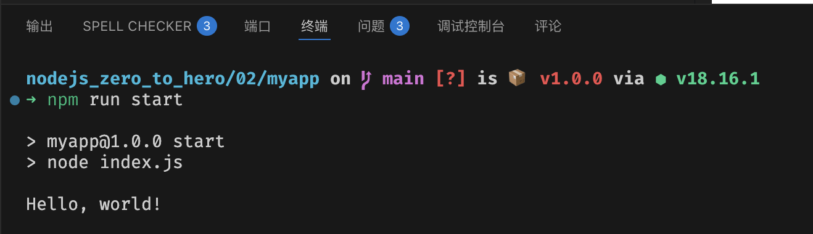

## Hello world

### 安装nodejs
mac 电脑安装node
```shell
brew install node

# 查看node版本
node -v

# 查看npm版本
npm -v
```

### npm（node package manager）
npm 是node的包管理工具，用于node插件管理（包括安装、卸载、管理依赖等）

#### npm常用命令
```shell
# 安装模块
npm install <Module Name>

# 卸载模块
npm uninstall <Module Name>

# 运行脚本
npm run <Script Name>
```

### 创建第一个node应用
```shell
# 创建项目目录
mkdir myapp
cd myapp

# 初始化项目 -y表示默认配置
npm init -y
```

然后呢，可以看到目录下多了一个package.json文件，这个文件是用来管理项目的配置信息的。

#### 正式开始
好了，可以开始写第一个node应用了，新建一个index.js文件，写入以下代码：
```js
console.log('Hello world')
```

修改package.json文件，添加一个脚本：
```json
"scripts": {
    "start": "node index.js"
}
```



成功！！！
