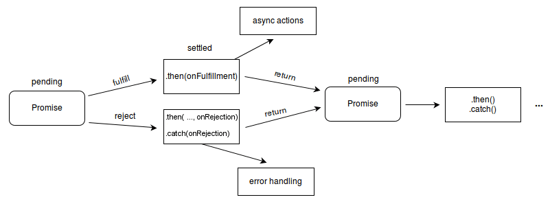

## 先认识认识js的变量类型

### js的变量类型
js的变量类型分为两种：基本数据类型和引用数据类型。

#### 基本数据类型
基本数据类型有：String、Number、Boolean、Null、Undefined。

#### 引用数据类型
引用数据类型有：Object、Array
> ES6新增了一些数据类型，先别管，后面再说。

⚠️注意：
js这种弱类型的语言，存在 == 于 === 的区别，==是比较值，===是比较值和类型。
比如：
```js
1 == '1' // true
1 === '1' // false
```
双等很容易出现隐式类型转换，所以在比较的时候，尽量使用三等。类型转化的规则很乱，可以先不要去记忆，目前工程实践一般都是使用三等，可以用过 Eslint 执行的工具进行检查，避免使用双等。

### 变量的声明
js的变量声明有三种方式：var、let、const。
现在用的最多的还是let和const，var已经不推荐使用了。

#### var
var是es5的语法，是全局变量，没有块级作用域，只有函数作用域。

#### let
let是es6的语法，是局部变量，有块级作用域。

#### const
const是es6的语法，是常量，一旦声明，不可更改。

举个例子🌰
```js
/**
 * var声明变量的特点 是会先把这个声明提升到最前面，但是不会赋值
 * 相当于
 * 1. var a;
 * 2. a = 1
 * 把这个1放在程序的最前面执行
*/
console.log(a) // undefined

var a = 1
```

```js
/**
 * let声明变量的特点 是不会提升，所以在声明之前使用会报错
*/
console.log(b) // 报错

let b = 1
```

```js
/**
 * const声明变量的特点 是不可更改
 * 但是引用类型的数据，值（object的键值，array的长度等）是可以更改的
*/
const c = 1
c = 2 // 报错

const d = {name: '张张'}
d.name = '张张🐦' // 不报错
```
> 其实这部分和其他语言差别没有特别大，知道上边这么多我认为就够用了，可以通过实践学习。更多： https://zh.javascript.info/variables

#### 函数 Function
js的函数是一等公民，可以作为参数传递，也可以作为返回值返回。

```js
function add(a, b) {
    return a + b
}
add(1, 2) // 3
```

#### 异步 ***重点！*** [Promise](https://zh.javascript.info/promise-basics)
>推荐一读，很有帮助！ https://zh.javascript.info/promise-basics

背景：
因为 nodejs 是基于 v8 引擎的，最早只在用在了浏览器端，通常只有单线程运行的；
但是存在很多I/O，网络请求之类的耗时操作
所以异步是非常重要的，js的异步有很多种，比如：Promise、async/await、callback等。

举个例子🌰：
先以 Promise 为例，Promise 是一个对象，用来处理异步操作。
Promise 有三种状态：pending、fulfilled、rejected。

- 待定（pending）：初始状态，既没有被兑现，也没有被拒绝。
- 已兑现（fulfilled）：意味着操作成功完成。
- 已拒绝（rejected）：意味着操作失败。

如果一个 Promise 已经被兑现或拒绝，即不再处于待定状态，那么则称之为已敲定（settled）。


⬆️ 来自: https://developer.mozilla.org/zh-CN/docs/Web/JavaScript/Reference/Global_Objects/Promise

```js
const myFirstPromise = new Promise((resolve, reject) => {
  // 当异步操作成功时，我们调用 resolve(...)，当其失败时，调用 reject(...)。
  // 在这个例子中，我们使用 setTimeout(...) 来模拟异步代码。
  // 在实际情况中，你可能会使用类似 XHR 或 HTML API 等。
  setTimeout(() => {
    resolve("成功！"); // 耶！一切顺利！
  }, 250);
});

myFirstPromise.then((successMessage) => {
  // successMessage 是我们在上面的 resolve(...) 函数中传入的任何内容。
  // 它不一定是字符串，但如果它只是一个成功的消息，那么它大概率是字符串。
  console.log(`耶！${successMessage}`);
});
```

### 使用
请看 demo 文件夹📁

知道了上边这些js和其他语言有所区别的地方，明天就可以启动一个真正的http服务了！！！
