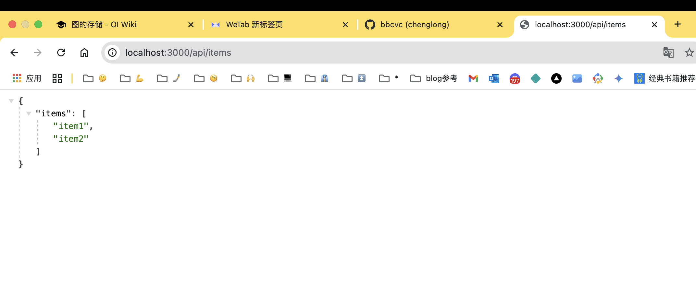

## 创建node的入门服务

### ES module vs CommonJS
因为启动一个服务要引入一些模块，那就先得说说怎么引入这些模块。
常用的两个规则（其实现在基本都在用ESM了，commonJS用得少了点）
- ES module: import/export
- CommonJS: require/module.exports
CommonJS 与 ESM（ECMAScript 模块）的区别


1. 语法
CommonJS
使用 require 导入模块。
使用 module.exports 导出模块。

```js
// 导入
const moduleA = require('./moduleA');
```

// 导出
module.exports = value;
ESM
使用 import 导入模块。
使用 export 导出模块。
```js
// 导入
import moduleA from './moduleA';

// 导出
export default value;
```
1. 模块加载
``CommonJS``: 
同步加载模块。
在服务器端 Node.js 中广泛使用。
``ESM``:
异步加载模块。
在现代 JavaScript 环境（浏览器、Node.js 14+ 支持 ESM）中使用。

2. 环境设置
``CommonJS``
脚本文件默认是 CommonJS 模块。
文件需要以 .js 结尾。
``ESM``
需要通过以下方式设置 ESM：
文件后缀为 .mjs。
包含 "type": "module" 在 package.json 中。

3. 循环依赖
``CommonJS``
处理循环依赖的机制：
如果模块 A require 模块 B，而模块 B 也 require 模块 A，那么模块 A 和 B 会返回一个空对象，但后续可以通过修改属性来处理。
``ESM``
在 ESM 中，循环依赖会导致错误。
导出的绑定是实时的，因此需要小心处理。

4. 动态导入
``CommonJS``:
require 是同步的，无法动态加载模块。
``ESM``:
支持动态导入：
```js
import(moduleName).then((module) => {
  console.log(module);
});
```

5. 配置文件支持
``CommonJS``:
不支持 package.json 配置模块化类型。
``ESM``:
支持 package.json 中的 "type": "module" 配置。

太长不看：
- CommonJS 是同步加载模块，ESM 是异步加载模块。
- CommonJS 是在 Node.js 中广泛使用，ESM 是现代 JavaScript 环境中使用，但nodejs >= 14也支持ESM了。
- ESM 是推荐的模块引入方式，是未来的趋势，也也和``flutter``有点像

具体的区别可以参考[这篇文章](https://www.ruanyifeng.com/blog/2020/08/how-nodejs-use-es6-module.html)


> 我们这里使用 ES module 来引入模块，在`package.json`中添加`"type": "module"`，这样就可以使用ES module了。


## 服务启动！

1. 先运行一个简单点的看看
```js
// 引入 Node.js 的 http 模块
import http from 'http';

// 创建一个 HTTP 服务器
const server = http.createServer((req, res) => {
    // 设置响应状态码和内容类型
    res.statusCode = 200;
    res.setHeader('Content-Type', 'text/plain');
    
    // 返回响应内容
    res.end('你好，这是我的第一个 Node.js 后端服务！');
});

// 监听端口
const PORT = 3000;
server.listen(PORT, () => {
    console.log(`服务器已启动，监听在 http://localhost:${PORT}`);
});
```

然后搞一个有点功能的
```js
import http from 'http';
import url from 'url';

const server = http.createServer((req, res) => {
    // 解析请求 URL
    const parsedUrl = url.parse(req.url, true);
    const pathname = parsedUrl.pathname;

    // 根据 URL 路径处理不同请求
    if (pathname === '/' && req.method === 'GET') {
        // 主页
        handleHomePage(req, res);
    } else if (pathname === '/api/items' && req.method === 'GET') {
        // 获取商品列表接口
        handleItemsApi(req, res);
    } else {
        // 默认处理
        handleNotFound(req, res);
    }
});

server.listen(3000, () => {
    console.log('服务器已启动，监听在 http://localhost:3000');
});
```



棒🎉
