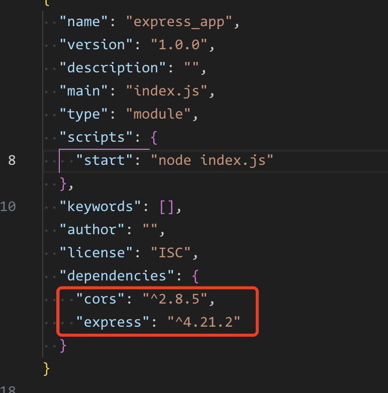
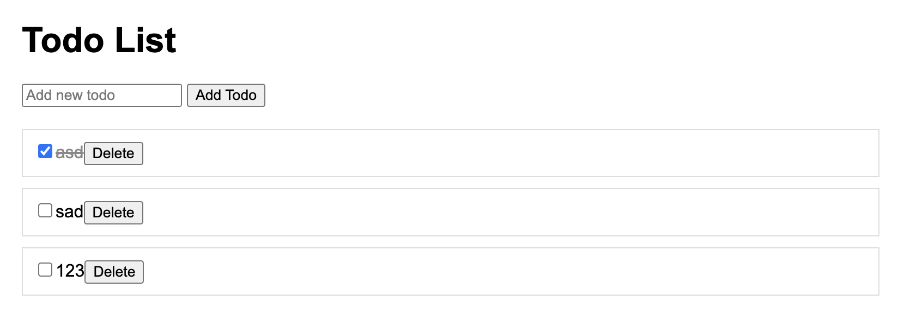
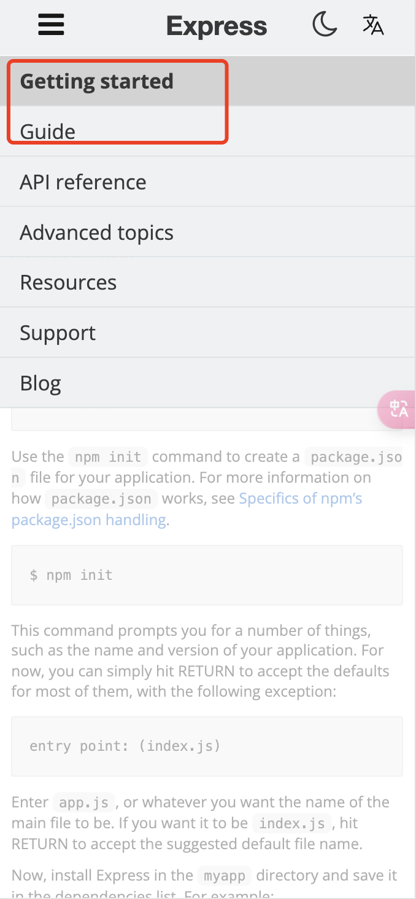

# 开始实践

## 使用nodejs直接构建一个server是很麻烦的，包括路由、参数解析、静态文件处理等等，所以我们使用express来构建server

### 安装express

```bash
npm install express cors
```

安装成功后会看到package.json中多了express 与 cors 的依赖


### 创建server.js
```js
// server.js
import express from 'express';
import cors from 'cors';

const app = express(); // 实例化express
const port = process.env.PORT || 3000;

// 中间件
app.use(cors()); // 允许跨域
app.use(express.json());

// 数据存储（模拟数据库）
let todos = [];
let idCounter = 1;

// 路由
app.get('/api/todos', (req, res) => {
  res.json(todos);
});

app.post('/api/todos', (req, res) => {
  const newTodo = {
    id: idCounter++,
    title: req.body.title,
    completed: false
  };
  todos.push(newTodo);
  res.status(201).json(newTodo);
});

app.put('/api/todos/:id', (req, res) => {
  const todoId = parseInt(req.params.id);
  const updatedTodo = todos.find(todo => todo.id === todoId);
  
  if (updatedTodo) {
    updatedTodo.completed = !updatedTodo.completed;
    res.json(updatedTodo);
  } else {
    res.status(404).json({ message: 'Todo not found' });
  }
});

app.delete('/api/todos/:id', (req, res) => {
  const todoId = parseInt(req.params.id);
  const index = todos.findIndex(todo => todo.id === todoId);
  
  if (index !== -1) {
    todos.splice(index, 1);
    res.json({ message: 'Todo deleted' });
  } else {
    res.status(404).json({ message: 'Todo not found' });
  }
});

// 启动服务器
app.listen(port, () => {
  console.log(`启动了，监听本地 ${port} 端口`);
});
```

从这个案例可以看出，express的使用非常简单，只需要实例化一个app，然后使用app.get、app.post等方法来定义路由即可。与原生使用nodejs的http模块相比，做了非常多的简化。

简单叫ai写一下前端，看下效果，有点丑😳



> 增，删，改，查都可以了，这个server就是一个简单的CRUD的server

今天知识点：

1. express的实例化
```js
const app = express(); // 实例化express
```
其实就是直接调用express()方法，返回一个express实例，这个实例就是我们的server

2. use中间件
```js
app.use(cors()); // 允许跨域
```
所有使用这个服务的请求都会经过``cors``这个中间件

3. get、post、put、delete路由
```js
app.get('/api/todos', (req, res) => {
  res.json(todos);
});
```

app.(请求方法)('path', callback)这个方法就是定义路由
第一个参数是路由的路径  
第二个参数是回调函数，回调函数有两个参数，req和res，分别是请求和响应

4. 启动服务器
```js
app.listen(port, () => {
  console.log(`启动了，监听本地 ${port} 端口`);
});
```

### 扩展阅读📖

blog：https://javascript.ruanyifeng.com/nodejs/express.html

doc：https://expressjs.com/en/starter/installing.html（先看开头1，2章就行，后边是一些下载静态文件，重定向，获取操作cookie之类的方法）



good！👏，是不是非常简单的学会启动一个服务了😊
